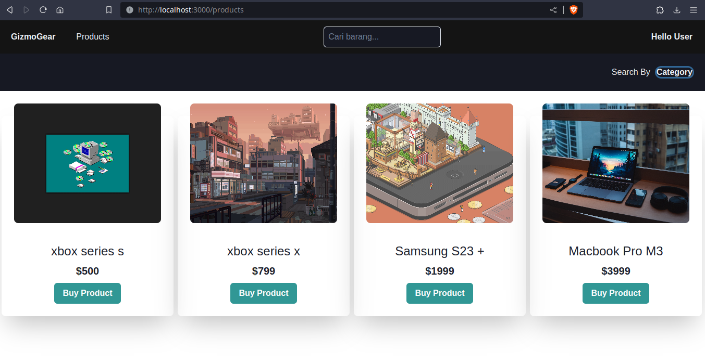

<h1 align=center>GizmoGear</h1>

# Project Title

The planned application will be a mini ecommerce, for the time being it can only carry out CRUD product operations


## Screenshots




## Tech Stack

**Client:** React, Recoil,ChakraUI, React-query, React-hook-form

**Server:** Laravel


## Run Locally

Clone the project

```bash
  git clone https://github.com/RizkiRdm/gizmogear.git
```

Go to the client-app directory

```bash
  cd client-app
```

Install dependencies

```bash
  npm install
```

Start the server

```bash
  npm run dev
```

then go to server directory

```bash
  cd server
```

Install dependencies

```bash
  composer install && npm install
```

Start the server

```bash
  php artisan serve
```

if storage unlink, run 
```bash
php artisan storage:link
```


## Feedback

If you have any feedback, please reach out to us at rizkiromdhoni28@gmail.com

